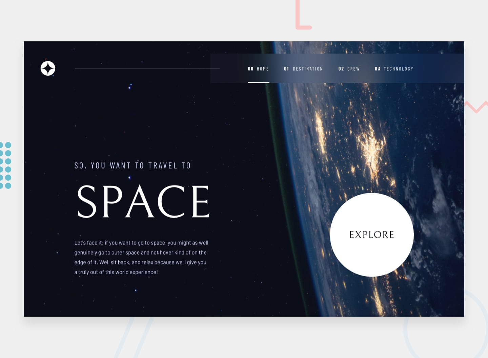

# Frontend Mentor - Space tourism website solution

This is a solution to the [Space tourism website challenge on Frontend Mentor](https://www.frontendmentor.io/challenges/space-tourism-multipage-website-gRWj1URZ3). The project was rebuilt from scratch with React + Vite and styled to match the provided design references across mobile, tablet, and desktop breakpoints.

## Table of contents

- [Overview](#overview)
  - [The challenge](#the-challenge)
  - [Screenshot](#screenshot)
  - [Links](#links)
- [My process](#my-process)
  - [Built with](#built-with)
  - [Project structure](#project-structure)
  - [What I learned](#what-i-learned)
  - [Continued development](#continued-development)
  - [Useful resources](#useful-resources)
  - [AI Collaboration](#ai-collaboration)
- [Setup and run](#setup-and-run)
- [Author](#author)
- [Acknowledgments](#acknowledgments)

## Overview

### The challenge

Users should be able to:

- View the optimal layout for each of the website's pages depending on their device's screen size
- See hover states for all interactive elements on the page
- View each page and toggle between destination, crew, and technology content states

### Screenshot



### Links

- Solution URL: [Add your Frontend Mentor solution URL](https://www.frontendmentor.io/)
- Live Site URL: [Add your deployed live URL](https://example.com)

## My process

### Built with

- Semantic HTML5
- CSS custom properties
- Flexbox
- CSS Grid
- Mobile-first workflow
- React 18
- Vite 4

### Project structure

```text
space_tourism/
├─ public/
│  └─ images/               # challenge-provided assets
├─ src/
│  ├─ App.jsx               # page switching + tab/dot/number interactions
│  ├─ main.jsx              # React entry point
│  ├─ styles.css            # complete responsive styling
│  └─ assets/data.json      # destination, crew, technology content
├─ design/                  # design reference JPGs
├─ index.html
└─ package.json
```

### What I learned

This rebuild reinforced a few important frontend implementation patterns:

1. **State-driven page composition without routing**  
   The app uses local page state (`home`, `destination`, `crew`, `technology`) and content indexes to drive all UI states cleanly from a single component.

2. **Content scaling and viewport-fit balance**  
   Matching visual design is not just typography and spacing — it also requires controlling section height and responsive image sizing so pages do not overflow unnecessarily.

3. **Responsive asset strategy**  
   Swapping page backgrounds by breakpoint and using `picture` for technology imagery helps keep each viewport aligned to design intent.

A representative snippet:

```jsx
const [page, setPage] = useState("home");
const [destinationIndex, setDestinationIndex] = useState(0);
const [crewIndex, setCrewIndex] = useState(0);
const [technologyIndex, setTechnologyIndex] = useState(0);
```

```css
.page-home {
  background-image: url("/images/home/background-home-mobile.jpg");
}

@media (min-width: 700px) {
  .page-home {
    background-image: url("/images/home/background-home-tablet.jpg");
  }
}

@media (min-width: 1000px) {
  .page-home {
    background-image: url("/images/home/background-home-desktop.jpg");
  }
}
```

### Continued development

Areas to improve in a next iteration:

- Add keyboard focus refinements and stronger accessibility semantics for tab-like controls
- Convert page navigation to URL-based routing while preserving the same UI
- Add visual regression checks for each design breakpoint
- Extract reusable UI primitives to keep `App.jsx` slimmer

### Useful resources

- [Frontend Mentor](https://www.frontendmentor.io/) - Challenge brief and design behavior expectations.
- [MDN - CSS Grid](https://developer.mozilla.org/en-US/docs/Web/CSS/CSS_grid_layout) - Useful for responsive layout alignment.
- [MDN - picture element](https://developer.mozilla.org/en-US/docs/Web/HTML/Element/picture) - Helpful for responsive technology imagery.
- [React Docs](https://react.dev/) - State management and rendering patterns.

### AI Collaboration

AI tooling was used as a coding assistant during implementation and refinement.

- **How it was used:** rapid iteration, component restructuring, CSS tuning, and README drafting
- **What worked well:** fast rewrite cycles and quick layout adjustments after feedback
- **What needed correction:** initial UI scale was too large and required manual tuning for viewport fit

## Setup and run

### Prerequisites

- Node.js 18+
- npm 9+

### Install

```bash
npm install
```

### Start development server

```bash
npm run dev
```

### Production build

```bash
npm run build
```

### Preview production build

```bash
npm run preview
```

## Author

- Name - Rafi
- Frontend Mentor - [@yourusername](https://www.frontendmentor.io/profile/yourusername)

## Acknowledgments

Challenge by [Frontend Mentor](https://www.frontendmentor.io/).  
Design assets are provided as part of the challenge starter files.
